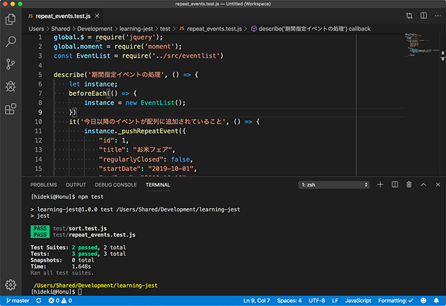
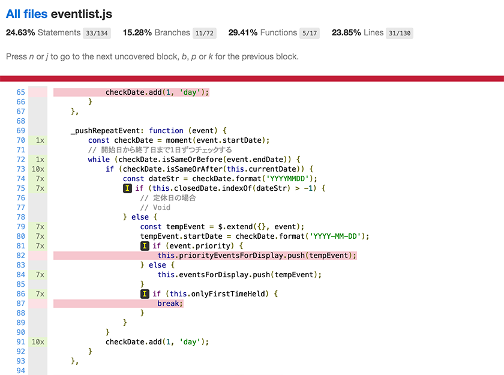

# Jestを用いたJavaScriptのテストの研究

## テストの準備

`npm i`を実行します。

## テストの実行

`npm test`を実行します。  

`npm test -- --coverage`を実行するとカバレッジの取得もできます。`coverage/lcov-report/eventlist.js.html`に生成されるHTMLをブラウザで開くと分かりやすいです。  

## メモ

- `src/eventlist.js`をES2015+で記述すれば良かったし、脱jQueryしたい
- [Moment.js](https://momentjs.com/)を[Luxon](https://moment.github.io/luxon/index.html)に変更したい
